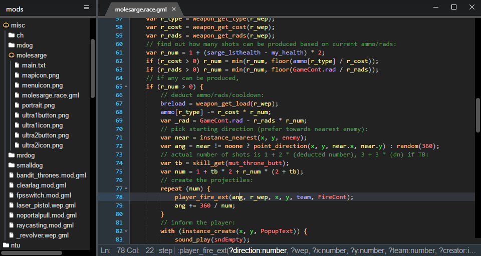

# Using GMEdit for Nuclear Throne Together

## Setup
1. Open the API directory.  
	You can do so by clicking  
	`☰` Menu ➜ Preferences ➜ "Other useful things" (at the bottom) ➜ GML dialects directory  
	_or_ by navigating to
	```
	%APPDATA%\AceGM\GMEdit\api
	```
	(can copy-paste the path into Explorer's "address bar")
2. Create a directory called `ntt`
3. Copy the files from this directory
	(checkout / [download](https://github.com/YAL-Game-Tools/bits-of-nuclear-throne/archive/refs/heads/main.zip) the repository)
	to that newly created directory so that `config.json` is inside `ntt`
	(no subdirectories)
4. Restart GMEdit!

## Use
With the dialect installed,
`☰` Menu ➜ Open should now allow you to select any file type,
and selecting a `main.txt` file should open the containing directory
for editing with NTT's functions in mind:



If your mod does not use `main.txt`, you can make a blank one -
the file is used merely as a way to tell apart a NTT mod directory from a regular directory
with GameMaker script files.

From here you can click on your `.gml`/`.ntgml` files in the "resource tree" to edit them,
click on images to preview them, and use Ctrl+R to reload the file list if necessary.

## Updating API
When new NTT versions come out,
GMEdit dialect doesn't automatically become aware of any new functions.
Fortunately, you can update the API files yourself:

1. Open NTT
2. Open chat (`T`)
3. Run the following command:
	```
	/api
	```
4. Navigate to
	```
	%LOCALAPPDATA\nuclearthrone\api
	```
	(can copy-paste the path into Explorer's "address bar")
5. Copy `api.gml` and `raw-assets.gml` to the `ntt` directory
	inside GMEdit's AppData directory that you have created during Setup.
6. Restart GMEdit!
